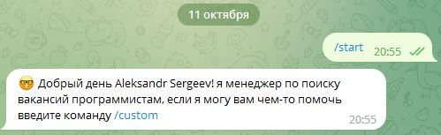
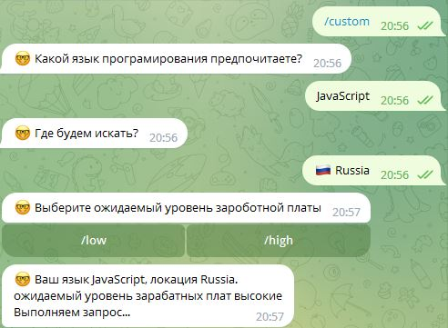
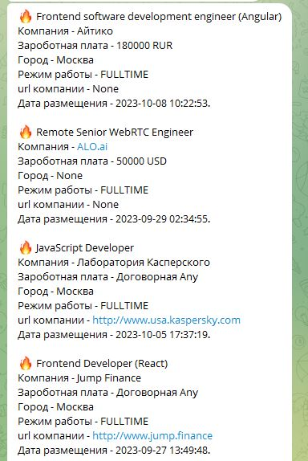
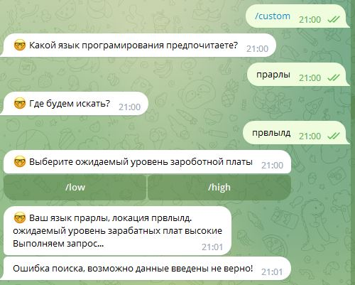

## Телеграмм Бот для поиска вакансий в IT сфере

### Cтруктура проекта:
1. API_requests
2. config_data
3. databasa
4. handlers
5. KeyBoards
6. loader.py 
7. main.py

API_requests - отвечает за отправку и получение запроса на сервер
  , а также обработку json данных.

config_data - отвечает за подключение переменных окружения.

databasa - отвечает за работу базы данных, выполняет получение и запись данных

handlers - отвечает за обработку команд бота

KeyBoards - отвечает за клавиатуры бота

loader.py - отвечает за подключение через ТОКЕН к телеграмм боту

main.py - отвечает за всю работу бота

### Команды бота:
1. /start - начало работы с ботом
2. /help - вывод справки по основным командам
3. /history - вывод истории пользователя
4. /custom - начало составления запроса
5. /low - ожидаемый уровень зароботных плат (невысокий)
6. /high - ожидаемый уровень зароботных плат (высокий)

### Начало работы с ботом:

- введите команду /start;
- бот выводит сообщение:
- 
- введите команду /custom

- бот задаст вам вопросы по выбору языка програмирования, локации и уровня зароботной платы и автоматически отправит и выполнит запрос:
- 

- при успешном выполнении запроса бот отправит сообщение:
- 

- в случае неудачного запроса бот выведит сообщение:
- 

- при желании запрос можно повторить не один раз.
